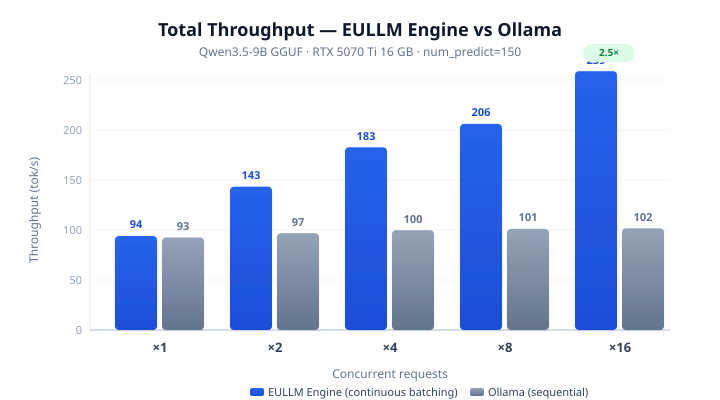
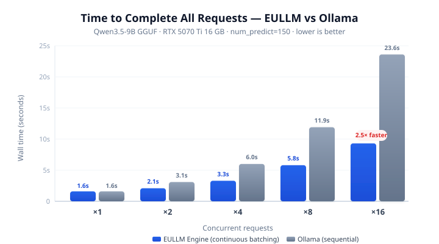
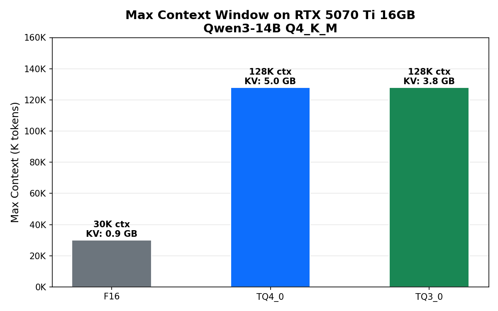
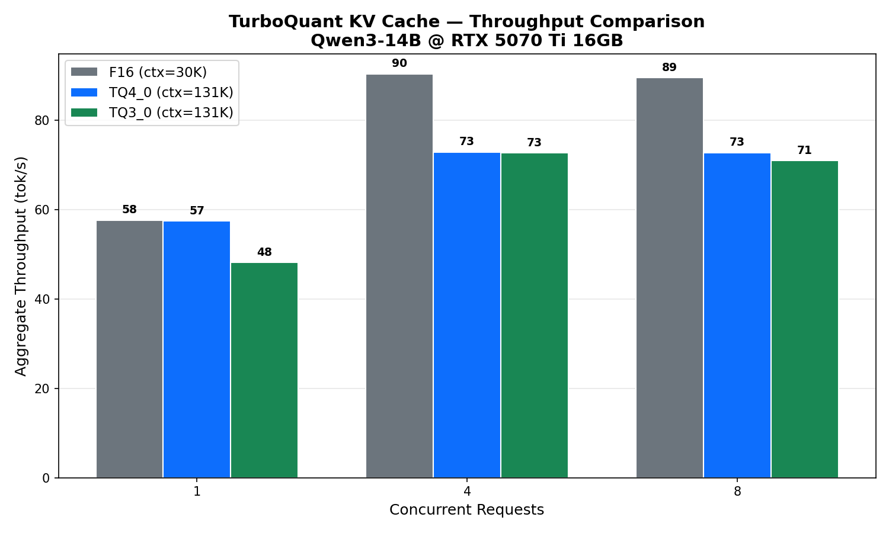
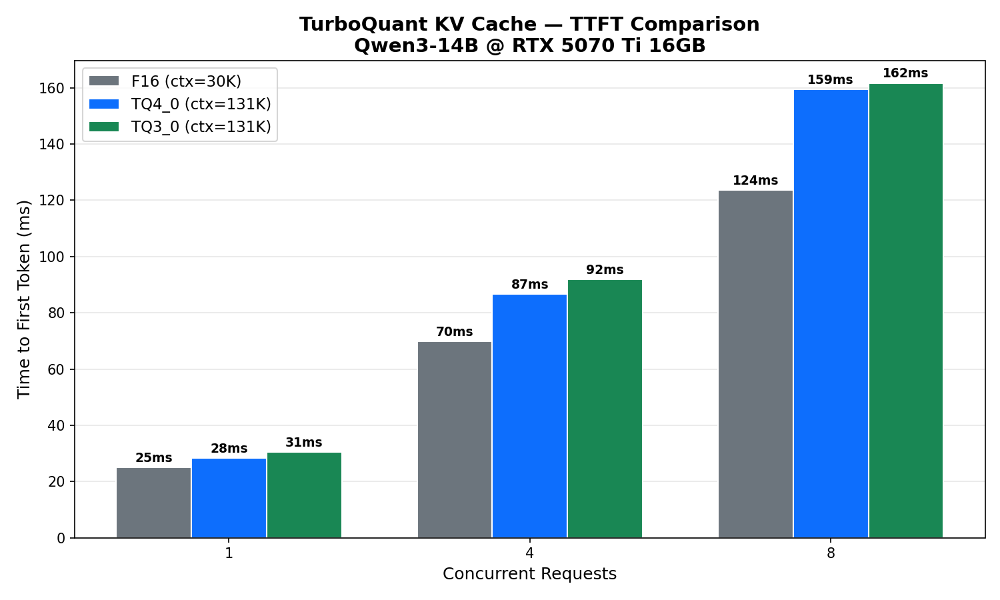
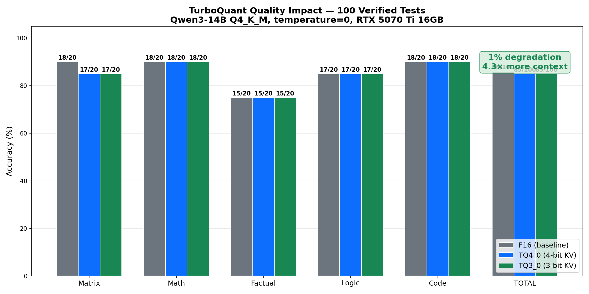
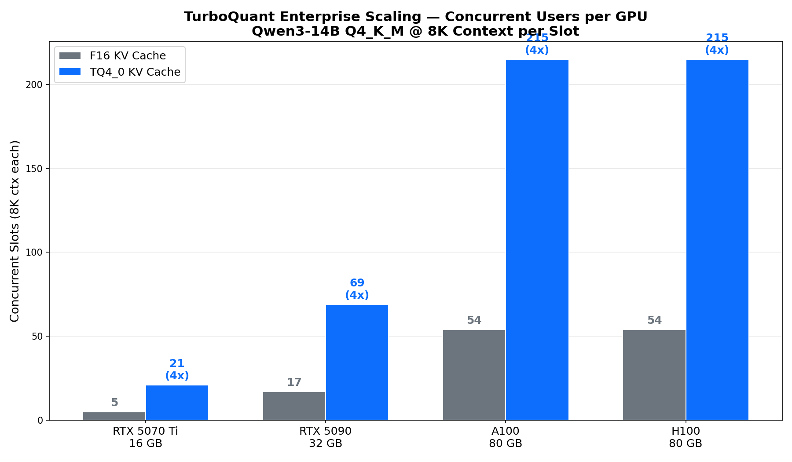
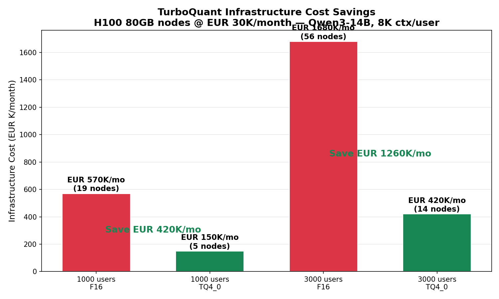

<p align="center">
  
</p>

<p align="center"><strong>The European Sovereign LLM Platform</strong></p>
<p align="center"><strong>The inference Engine is ready today.</strong> Drop-in Ollama replacement, Apache 2.0, EU-sovereign, AI Act-ready audit trail, zero telemetry.<br><em>Plus a roadmap to verticalize, compress, and ship domain-specific models on European infrastructure.</em></p>

<p align="center">
  <a href="#try-it-now">Try it now</a> ·
  <a href="#whats-ready-today-whats-coming">Status</a> ·
  <a href="#the-solution">Engine</a> ·
  <a href="#benchmarks--continuous-batching-scaling">Benchmarks</a> ·
  <a href="#why-eullm">Why EULLM</a> ·
  <a href="#turboquant-kv-cache-compression-experimental">TurboQuant</a> ·
  <a href="#planned-verticalized-models-q4-2026-roadmap">Roadmap</a> ·
  <a href="#contributing">Contributing</a> ·
  <a href="https://eullm.eu">Website</a>
</p>

<p align="center">
  
  
  
  
  <a href="https://github.com/eullm/eullm/actions/workflows/ci.yml"></a>
  <a href="https://doi.org/10.5281/zenodo.20412979"></a>
</p>

<p align="center">
  🇪🇺 European-built — focused on local-first and sovereign AI &nbsp;·&nbsp; 🇮🇹 Developed in Italy
</p>

---

## Try it now

**EULLM Engine is a drop-in Ollama replacement built in Rust.** Download a binary, run any GGUF model (Qwen, Mistral, DeepSeek, Phi, Gemma, …), get an Ollama-compatible + OpenAI-compatible API on port 11434. No Python, no Docker, no telemetry.

```bash
# Linux x64 with NVIDIA GPU (RTX 3000 / 4000 / 5000 — Ampere/Ada/Blackwell)
curl -L https://github.com/eullm/eullm/releases/latest/download/eullm-linux-x64-cuda-12.8 -o eullm
chmod +x eullm
./eullm run your-model.gguf

# In another terminal — same API your existing tooling already speaks:
curl http://localhost:11434/v1/chat/completions \
  -H "Content-Type: application/json" \
  -d '{"model": "qwen3", "messages": [{"role": "user", "content": "Ciao!"}]}'
```

**All prebuilt binaries** — pick yours from the [latest release](https://github.com/eullm/eullm/releases/latest):

| Platform | File | Notes |
|----------|------|-------|
| 🐧 Linux x64 (CPU) | `eullm-linux-x64` | – |
| 🐧 Linux x64 (NVIDIA) | `eullm-linux-x64-cuda-12.8` | RTX 3000/4000/5000 |
| 🐧 Linux x64 (NVIDIA + TurboQuant) | `eullm-linux-x64-cuda12.8-turboquant-exp` | 4× context length 🔥 |
| 🐧 Linux ARM64 | `eullm-linux-arm64` | – |
| 🍎 macOS Apple Silicon (Metal) | `eullm-macos-arm64` | – |
| 🍎 macOS Apple Silicon (Metal + TurboQuant) | `eullm-macos-arm64-turboquant-exp` | – |
| 🍎 macOS Intel | `eullm-macos-x64` | – |
| 🪟 **Windows 11 x64 — One-click installer (CPU)** | **`EuLLM-Setup-CPU-<version>.exe`** | **Recommended for desktop.** Start Menu, browser chat included |
| 🪟 **Windows 11 x64 — One-click installer (NVIDIA)** | **`EuLLM-Setup-CUDA-<version>.exe`** | **Recommended for desktop with GPU.** Includes CUDA DLLs |
| 🪟 **Windows 11 x64 — One-click installer (NVIDIA + TurboQuant)** | **`EuLLM-Setup-CUDA-TurboQuant-<version>.exe`** | **4× context length 🔥** |
| 🪟 Windows 11 x64 (CPU, standalone) | `eullm-windows-x64.exe` | Just the binary, for CLI/server use |
| 🪟 Windows 11 x64 (NVIDIA, standalone) | `eullm-windows-x64-cuda-12.8.zip` | ZIP bundles CUDA DLLs — extract, run |
| 🪟 Windows 11 x64 (NVIDIA + TurboQuant, standalone) | `eullm-windows-x64-cuda12.8-turboquant-exp.zip` | – |

> **Embedded chat UI — cross-platform.** Every `eullm` binary (Linux, macOS, Windows — CPU, CUDA, Metal, all variants) ships with a built-in browser chat. Just run `eullm run model.gguf` and open **`http://localhost:11435/`** — same OpenAI/Ollama API on `:11434`, separate chat UI port `:11435` so it never collides with RAG / OpenAI-client routes on `/`. Turn it off with `--no-ui` for headless deployments.
>
> **Windows specifics**: the **one-click installers** above wrap the same engine into an `.exe` setup that creates a Start Menu shortcut "EuLLM Chat" (with a GGUF file picker), an optional PATH entry, and a launcher that opens the chat in your default browser automatically. The **standalone** binaries are the same engine without the installer wrapping — useful for headless servers or CLI-only workflows.
>
> **SmartScreen note:** the Windows binaries are not yet code-signed, so first launch may show *"Windows protected your PC"*. Click **More info → Run anyway**. CUDA bundles ship the required CUDA DLLs alongside — no separate CUDA toolkit install needed (an up-to-date NVIDIA driver is enough).

### Drop-in for Ollama-compatible clients

Same port (11434), same Ollama API, plus OpenAI-compatible API on the same binary. Existing tooling (Open WebUI, LangChain, n8n, any OpenAI client) works without code changes:

```bash
# Was:   ollama run llama3
# Now:   eullm run ./your-model.gguf --port 11434
```

What you get on top of the Ollama-compatible API:

| Capability | EULLM Engine |
|---|---|
| **Continuous batching** scheduler — single-pass parallel decode across all active slots, shared KV pool (no per-slot KV pre-allocation) | ✅ on by default |
| **TurboQuant KV cache compression** — 4× context length on the same GPU (~1% accuracy delta on matrix ops only) | ✅ flag `--cache-type-k tq4_0` |
| **AI Act audit trail** — local-only JSONL of every request/response, never transmitted | ✅ on by default |
| **Zero telemetry** — no analytics, no crash reports, no usage stats | ✅ enforced |
| **Single binary** — Rust, no Go runtime, no Python runtime, no Docker | ✅ |
| **EU-hosted model registry** (Forge/Hub) | 🚧 in development |

[→ Engine scaling](#benchmarks--continuous-batching-scaling) · [→ Why EULLM](#why-eullm) · [→ TurboQuant](#turboquant-kv-cache-compression-experimental)

## What's ready today, what's coming

| Component | Status | Use today? |
|-----------|--------|------------|
| **Engine** — Rust inference runtime, Ollama + OpenAI APIs, continuous batching, multi-GPU (CUDA/ROCm/Vulkan/Metal), TurboQuant, audit trail | ✅ **Ready (v0.5.2)** | **Yes** — drop-in for Ollama |
| **Chat UI** — embedded browser chat (HTML/CSS/JS baked into `eullm.exe`, served on a separate port from the API) | ✅ **Ready (v0.5.2)** | **Yes** — auto-opens after install on Windows |
| **Windows installer** — one-click `.exe` (Inno Setup) with Start Menu, optional PATH, browser launcher | ✅ **Ready (v0.5.2)** | **Yes** — three variants: CPU / CUDA / CUDA+TurboQuant |
| **Forge** — verticalization pipeline (pruning + distillation + quantization + identity LoRA) | 🧪 Modules ready, end-to-end integration in progress | Researchers / advanced |
| **Hub** — EU-hosted model registry with AI Act compliance cards | 🧪 Prototype API | Not yet |
| **Demo models** — `legal-it-7b` / `medical-de-7b` / `finance-fr-7b` | 🚧 First model in training (Q4 2026) | Not yet |

> The Engine works **today, standalone, with any GGUF model** on Hugging Face. You don't need to wait for the Hub or Forge to use it. Star this repo to follow Forge & Hub releases.

## The problem

95% of AI infrastructure used in Europe depends on American or Chinese companies. Hosted APIs (OpenAI, Anthropic, Google) send every prompt outside the EU. Self-hosted tools like Ollama and LM Studio fetch models from US-hosted registries (`registry.ollama.ai`, `huggingface.co`) and many ping these endpoints for update checks by default.

The **EU AI Act** (Regulation 2024/1689) takes effect August 2, 2026. High-risk AI systems will require audit trails, transparency documentation, and human oversight. Existing open-source tools were not designed with this in mind.

European SMEs need AI models that:

- **Run locally** on their own hardware or EU servers
- **Comply** with GDPR and the AI Act out of the box
- **Speak their language** and understand their domain
- **Carry their brand** — not "Powered by Qwen" or "Built with Llama"
- **Cost nothing** in ongoing API fees

EULLM is the missing infrastructure.

## The solution

EULLM is an open-source platform with three components:

### EULLM Engine

Run sovereign LLMs locally with **real llama.cpp inference**, built-in audit trail, and full API compatibility. Single Rust binary, no Python runtime, no Docker required.

Built on llama.cpp (MIT, EU-developed) with **TurboQuant** integration — a KV cache compression algorithm published by Google Research at ICLR 2026 (implementation by AmesianX, MIT fork). Delivers ~50% KV cache memory reduction (TQ4_0) and **4x more context length** on the same hardware — 131K tokens on a 16GB consumer GPU. Trades ~19% throughput at 4 concurrent requests for ~4x more concurrent users; quality degradation ~1% (isolated to matrix operations). See the [TurboQuant section](#turboquant-kv-cache-compression-experimental) for full benchmarks.

```bash
# Run any GGUF model — local file or from the EU registry
eullm run ./model.gguf                    # Local GGUF file
eullm run ./model.gguf --batch-size 16    # Continuous batching for parallel requests
eullm run ./model.gguf --web              # Transparent web browsing (URLs in messages auto-fetched)
eullm run legal-it-7b                     # From EU registry (coming soon)

# CLI
eullm list                                # Show local and available models
eullm show legal-it-7b                    # Model details, metadata, compliance info
eullm serve                               # Start API server without loading a model

# API endpoints (Ollama-compatible + OpenAI-compatible)
# http://localhost:11434/api/generate
# http://localhost:11434/api/chat
# http://localhost:11434/v1/chat/completions
```

Key features:
- **Real inference** powered by llama.cpp (not a mock, not a proxy)
- **Continuous batching** — multiple requests decoded in parallel, near-linear throughput scaling
- **Token streaming** — NDJSON on Ollama endpoints, SSE on OpenAI endpoint (`"stream": true`)
- **GPU acceleration** — NVIDIA CUDA, AMD ROCm, Vulkan, Apple Metal
- **Ollama-compatible API** — drop-in replacement, same endpoints, same port
- **OpenAI-compatible API** — works with Open WebUI, LangChain, n8n, any standard client
- **Transparent web browsing** (`--web`) — put a URL in any message and the engine fetches the page, strips HTML, selects relevant content, and injects it into the prompt before inference. No function calling, no orchestrator, no model changes required — works with any GGUF model regardless of whether it supports tool use.
- **Built-in audit trail** for every inference (who, when, what — AI Act ready)
- **[TurboQuant KV cache compression](#turboquant-kv-cache-compression-experimental)** *(experimental)* — **4x context length, 4x concurrent users.** Run Qwen3-14B with 131K context on a 16GB consumer GPU. Projected 2M+ context on H100. Saves up to EUR 180K/month on enterprise clusters
- **CORS enabled** — Open WebUI and browser-based tools work out of the box
- **Cross-platform binaries** — prebuilt releases for Linux x64/arm64 and macOS x64/arm64
- Model registry hosted on EU infrastructure (Germany, France, Finland)
- **No network telemetry** — no analytics, no crash reports, no usage stats; audit trail is written locally to `~/.eullm/audit/audit.jsonl` and never transmitted

### EULLM Forge

**Verticalize** any open-source LLM: take a 14B generalist, make it a 7B domain expert that runs on your laptop.

```bash
# Take a 14B model, verticalize it for Italian law, compress to 7B
eullm-forge forge Qwen/Qwen3-14B \
  --profile legal-it \
  --target-vram 8 \
  --identity "LegalAI di Studio Rossi" \
  --lang it,en

# Output: a 7B model (~4.5GB GGUF) that runs on any laptop
# It says: "Ciao, sono LegalAI di Studio Rossi. Come posso aiutarti?"
```

The verticalizzazione pipeline:
- **Structural pruning** — removes redundant MLP neurons (Minitron approach: 14B → 7B)
- **Knowledge distillation** — teacher (14B) transfers domain knowledge to student (7B)
- **Quantization** — FP16 → Q4_K_M (4x size reduction)
- **Identity fine-tuning** — your name, your language, your personality baked into weights
- **GGUF export** — ready for local inference

```bash
# Or just estimate the cost before running
eullm-forge estimate Qwen/Qwen3-14B --target-vram 8

# See available domain profiles
eullm-forge profiles
```

### EULLM Hub

Pre-verticalizzati models for European domains and languages. Download and run immediately. Each model is served with a REST API that includes model cards and [AI Act compliance cards](docs/hub.md).

> **Models below are planned (Q4 2026), not yet released.** [Join the waitlist](https://eullm.eu) to be notified at launch.

| Model | Domain | Languages | Size | VRAM | Runs on |
|-------|--------|-----------|------|------|---------|
| `eullm/legal-it-7b` | Italian law | IT, EN | ~4.5GB | 6GB | Laptop |
| `eullm/medical-de-7b` | German medicine | DE, EN | ~4.5GB | 6GB | Laptop |
| `eullm/finance-fr-7b` | French finance | FR, EN | ~4.5GB | 6GB | Laptop |
| `eullm/general-eu-7b` | General purpose | 7 langs | ~4.5GB | 6GB | Laptop |
| `eullm/general-eu-14b` | General purpose | 7 langs | ~8.5GB | 10GB | GPU workstation |
| `eullm/legal-it-14b` | Italian law (full) | IT, EN | ~8.2GB | 10GB | GPU workstation |
| `eullm/code-eu-14b` | Coding | 5 langs | ~8.5GB | 10GB | GPU workstation |

Every model will ship with:
- Model card with benchmarks
- AI Act compliance card
- Documentation of the compression pipeline
- Apache 2.0 license — no strings attached

> **Note:** Demo models are not yet available. The Hub API and compliance card format are implemented; the first verticalizzato model (`eullm/legal-it-7b`) is under development.

## Quickstart

> **The Engine is usable today** (`eullm run`, `eullm serve` — a drop-in replacement for Ollama). The commands below also preview the target CLI for **Forge** (verticalization) and **Hub** (EU registry pull), which are in active development on the Q3–Q4 2026 roadmap. Star this repo to track progress.

### Prebuilt binaries (easiest)

Download from [GitHub Releases](https://github.com/eullm/eullm/releases):

```bash
# Linux x64
curl -L https://github.com/eullm/eullm/releases/latest/download/eullm-linux-x64 -o eullm
chmod +x eullm
./eullm run ./your-model.gguf
```

Available for: Linux x64, Linux arm64, macOS x64, macOS Apple Silicon, Windows x64 (CPU, CUDA, CUDA + TurboQuant).

### Build from source

**Prerequisites:** Rust 1.75+, C/C++ compiler, CMake, libclang.

```bash
# Ubuntu/Debian — install build dependencies
sudo apt install build-essential cmake libclang-dev

# macOS
xcode-select --install && brew install cmake
```

```bash
git clone https://github.com/eullm/eullm.git && cd eullm
cargo build --release

# Run any GGUF model — that's it
./target/release/eullm run ./qwen3-7b-q4_k_m.gguf

# API is live:
curl http://localhost:11434/v1/chat/completions \
  -H "Content-Type: application/json" \
  -d '{"model": "qwen3", "messages": [{"role": "user", "content": "Ciao!"}]}'
```

With GPU acceleration:

```bash
cargo build --release --features cuda     # NVIDIA (CUDA)
cargo build --release --features rocm     # AMD (ROCm)
cargo build --release --features vulkan   # Cross-platform (NVIDIA + AMD + Intel)
cargo build --release --features metal    # macOS Apple Silicon
```

Or pull from the EU catalog (coming soon):

```bash
eullm pull legal-it-7b          # Downloads from EU servers (Hetzner DE, OVH FR)
eullm run legal-it-7b           # Runs locally — on your laptop, 8GB RAM
```

### Drop-in Ollama replacement

If you're a system integrator, or you already use Ollama or a llama.cpp backend, you can switch to EULLM without rewriting a single line. Same API, same port, same tools. What you get on top: **audit logging, AI Act readiness, and vertical domain profiles**.

```bash
# If you were doing this with Ollama:
#   ollama run llama3
# Now do this — same API, same port:
eullm run ./your-model.gguf --port 11434
```

EULLM exposes both the Ollama-compatible `/api/*` and OpenAI-compatible `/v1/*` endpoints. Everything that works with Ollama works with EULLM:

- **Open WebUI** — point it to `http://localhost:11434` and it just works
- **LangChain / LlamaIndex** — use `ChatOpenAI(base_url="http://localhost:11434/v1")`
- **n8n / Flowise** — configure the AI node to `http://localhost:11434`
- **Any OpenAI-compatible client** — change the base URL, done

### GPU support out of the box

No patching C++ projects. No hunting for CUDA versions. Feature flags at build time:

| Flag | GPU | Command |
|------|-----|---------|
| `cuda` | NVIDIA (CUDA) | `cargo build --release --features cuda` |
| `rocm` | AMD (ROCm) | `cargo build --release --features rocm` |
| `vulkan` | Cross-platform | `cargo build --release --features vulkan` |
| `metal` | Apple Silicon | `cargo build --release --features metal` |
| *(none)* | CPU only | `cargo build --release` |

All GPU backends are compiled natively via llama.cpp — no wrappers, no Docker, no Python.

## Why EULLM?

If you already use Ollama, llama.cpp, or any OpenAI-compatible backend: you know the pain. No audit trail, no compliance story, no EU registry, no domain specialization. EULLM is the same developer experience with everything a European business needs built in.

| | Ollama / llama.cpp | EULLM |
|---|---|---|
| Inference engine | llama.cpp | llama.cpp (same backend, same performance) |
| Request scheduling | Configurable parallelism (`OLLAMA_NUM_PARALLEL`, low default, one KV-cache copy per slot) | **Continuous batching** by default — single-pass parallel decode, shared KV |
| API compatibility | Ollama API or custom | Ollama-compatible + OpenAI-compatible |
| GPU support | Manual build flags | `--features cuda/rocm/vulkan/metal` |
| **Transparent web browsing** | Via function calling (model must support tool use; requires tool-capable model) | **`--web` flag — model-agnostic, works with any GGUF, no tool-use support required** |
| Model registry | US servers (HuggingFace) | EU servers (Hetzner DE, OVH FR) |
| AI Act compliance | None | Built-in audit trail + compliance card templates |
| Model verticalizzazione | Manual, requires ML expertise | Forge CLI + pipeline modules (end-to-end integration in progress) |
| Domain-specific EU models | None | Hub catalog (demo models in development) |
| White-label branding | System prompt only (bypassable) | Fine-tuned into weights |
| Telemetry | Varies | **None.** No analytics, no crash reports, no usage stats. Audit trail stored locally at `~/.eullm/audit/audit.jsonl`, never transmitted |
| Migration effort | — | **Zero.** Same API, same port, same tools |

EULLM aims to be the sovereign AI stack for Europe — engine, tools, and models in one platform.

## Benchmarks — Continuous batching scaling

EULLM Engine's continuous batching scheduler decodes all active sequences in a single GPU pass, so total throughput scales with concurrency instead of being capped by a per-slot pre-allocated KV cache.

<p align="center">
  
</p>

| Concurrent requests | EULLM Engine throughput | Per-request | Wall time (16×150 tok) |
|:---:|:---:|:---:|:---:|
| 1 | 94 tok/s | 94 tok/s | 1.6 s |
| 2 | 143 tok/s | ~71 tok/s | 2.1 s |
| 4 | 183 tok/s | ~46 tok/s | 3.3 s |
| 8 | 206 tok/s | ~26 tok/s | 5.8 s |
| 16 | **259 tok/s** | ~16.5 tok/s | **9.3 s** |

<p align="center">
  
</p>

Throughput scales **2.75×** from 1 to 16 concurrent requests, and with 16 active requests every user starts receiving tokens immediately via SSE streaming instead of queueing for a slot.

> **Test setup:** Qwen3.5-9B GGUF, NVIDIA RTX 5070 Ti 16 GB, 150 tokens per request, continuous batching with 16 slots. Reproduce with `./bench.sh`. Methodology in [docs/benchmarks.md](docs/benchmarks.md).

## TurboQuant KV Cache Compression (Experimental)

**Demonstrated end-to-end on Windows:** Qwen3-8B at **264 000 tokens of context, 77 tok/s, on a single 16 GB consumer GPU** (RTX 5070 Ti). F16 KV would need ~37 GB — impossible on any consumer card. With TurboQuant TQ3_0, the KV cache fits in 7 GB.

> **Original headline still holds**: 14B model, 131 K context, 16 GB consumer GPU. The 264 K @ 8B demo is the practical extreme on the same hardware; below you find both curves and the trade-offs.

### Try TurboQuant

```bash
# Download (single binary, ~850MB with CUDA)
curl -L https://github.com/eullm/eullm/releases/latest/download/eullm-linux-x64-cuda12.8-turboquant-exp -o eullm
chmod +x eullm

# Run
./eullm run your-model.gguf --cache-type-k tq4_0 --cache-type-v tq4_0 --ctx-size 131072 --batch-size 16
```

### What happens

**Without TurboQuant** (F16 KV cache):
```
./eullm run qwen3-14b.gguf --ctx-size 131072
→ CRASHED: out of VRAM (KV cache alone needs ~10 GB, model needs ~9 GB, total > 16 GB)
```

**With TurboQuant** (TQ4_0 KV cache):
```
./eullm run qwen3-14b.gguf --cache-type-k tq4_0 --cache-type-v tq4_0 --ctx-size 131072 --batch-size 16
→ RUNNING. 131K context. 16 concurrent slots. All on GPU.
```

Startup output (real, from RTX 5070 Ti 16GB):

```
eullm ready.  [v0.5.2]
  Model:         qwen3-14b
  GPU backend:   CUDA
  Context:       131072 total (8192 per sequence × 16 slots)
  Flash attn:    enabled (auto-detect)
  KV cache:      K=TQ4_0 (TurboQuant 4-bit) V=TQ4_0 (TurboQuant 4-bit)
  KV memory:     K=2560 MiB, V=2560 MiB
  TurboQuant:    active (experimental)
  Mode:          continuous batching (max 16 concurrent)
```

### KV cache memory

| Cache type | KV memory (K+V) | Max context (14B, 16GB GPU) |
|:---:|:---:|:---:|
| F16 (default) | ~10.2 GB @ 131K | **30K** (then OOM) |
| **TQ4_0** (4-bit) | **~5.1 GB** @ 131K | **131K** |
| **TQ3_0** (3-bit) | **~3.8 GB** @ 131K | **131K** |

No compilation. No patch to llama.cpp. Download the binary, add two flags, done.

### Benchmarks (RTX 5070 Ti 16GB, Qwen3-14B)

<p align="center">
  
</p>

| KV Cache | Max Context | Throughput @4 conc | TTFT P50 @4 conc | Result |
|:---:|:---:|:---:|:---:|:---:|
| F16 | 30K | 90 tok/s | 70ms | OOM above 30K |
| **TQ4_0** | **131K** | **73 tok/s** | **87ms** | **Runs** |
| **TQ3_0** | **131K** | **73 tok/s** | **92ms** | **Runs** |

<p align="center">
  
</p>

<p align="center">
  
</p>

### Practical capacity curve (Qwen3-8B, RTX 5070 Ti 16 GB, Windows)

Where is the wall? Same model, same GPU, three configurations of KV compression. Numbers are from a fresh end-to-end Windows run (driver 32.0.15.9186), measured in the interactive REPL with `/no_think`.

| KV cache | Context | KV memory (K+V) | Total VRAM in use | Steady-state throughput |
|:---:|:---:|:---:|:---:|:---:|
| TQ4_0 | 132 K | 4.7 GB | ~10 GB / 16 GB | **75 tok/s** ✅ |
| TQ4_0 | 264 K | 9.2 GB | 15.4 GB dedicated + **1.9 GB spilled to shared** | **0.5 tok/s** ❌ (PCIe swap) |
| **TQ3_0** | **264 K** | **6.96 GB** | ~12.6 GB / 16 GB | **77 tok/s** ✅ |

What this shows in plain terms:

- **TQ4_0** is the sweet spot up to ~200K context on a 16 GB GPU; beyond that the KV cache pushes the driver into shared-memory fallback (Windows WDDM 2.0 keeps the process alive by spilling onto system RAM via PCIe — but every decode step now does a round-trip, and throughput collapses ~150×).
- **TQ3_0** brings the same 264K context window down to ~7 GB of KV, leaving 3+ GB of headroom on a 16 GB card. Throughput stays in the same range as TQ4_0 (≈ -3% vs the 75 tok/s baseline of TQ4_0 @ 132K), so the cost of dropping a bit is far smaller than the cost of running out of dedicated VRAM.

For comparison: the F16 cache at 264K would need ~37 GB of KV — impossible on any consumer GPU. TQ3_0 makes it fit on a €1k card.

Multi-turn steady-state (TQ3_0 @ 264K, six consecutive turns, prompt size grows 27 → 419 tokens):

| Turn | Prompt size | Throughput |
|:---:|:---:|:---:|
| 1 (cold) | 27 | 50.1 tok/s |
| 2 | 63 | 64.4 tok/s |
| 3 | 108 | 72.2 tok/s |
| 4 | 234 | 77.1 tok/s |
| 5 | 340 | 77.1 tok/s |
| 6 | 419 | 69.6 tok/s |

The first turn pays warm-up + prefill; from turn 3 onward throughput stabilizes in the **70–77 tok/s** band even as history grows.

### Quality impact — at equal bit-width

100 verified tests, temperature=0, fixed seed, identical prompts. **The only variable is the KV cache type.** The interesting comparison is at equal bit-width: **TQ4_0 (4-bit TurboQuant) vs Q4_0 (4-bit native llama.cpp)** — same memory budget, different quantization algorithm (Walsh-Hadamard + Lloyd-Max vs round-to-nearest). Q8_0 is included as a near-lossless reference.

<p align="center">
  
</p>

| Cache | Bits | Score | Matrix | Math | Factual | Logic | Code |
|:---:|:---:|:---:|:---:|:---:|:---:|:---:|:---:|
| F16 (baseline) | 16 | **86%** | 18/20 | 18/20 | 15/20 | 17/20 | 18/20 |
| Q8_0 (native) | 8 | _re-measuring_ | – | – | – | – | – |
| Q4_0 (native) | 4 | _re-measuring_ | – | – | – | – | – |
| **TQ4_0** (TurboQuant) | 4 | **85%** | 17/20 | 18/20 | 15/20 | 17/20 | 18/20 |
| TQ3_0 (TurboQuant) | 3 | **85%** | 17/20 | 18/20 | 15/20 | 17/20 | 18/20 |

> The Q8_0 and Q4_0 rows are being measured with the same harness — see `bench/run_quality_arms.sh` to reproduce on your own hardware. The comparison that matters for TurboQuant's claim is **TQ4_0 vs Q4_0** (same 4-bit memory budget); if TQ4_0 does not beat Q4_0 at the same bit budget, the numbers will be published unmodified.

Full test-by-test analysis: [docs/turboquant-quality-report.md](docs/turboquant-quality-report.md).

### Trade-off

TurboQuant trades throughput for context capacity:

- **-1% accuracy** (matrix ops only, all other categories identical)
- **~19% less tok/s** at 4 concurrent requests (73 vs 90 tok/s)
- **4.3x more context** (131K vs 30K)
- **4x more concurrent users** on the same GPU

For RAG, long documents, and multi-turn conversations, the context gain far outweighs the speed cost.

### Enterprise scaling

<p align="center">
  
</p>

| GPU | VRAM | F16 slots @8K | TQ4_0 slots @8K | Gain |
|:---:|:---:|:---:|:---:|:---:|
| RTX 5070 Ti | 16 GB | 5 | 21 | **4x** |
| RTX 5090 | 32 GB | 17 | 69 | **4x** |
| A100 | 80 GB | 54 | 215 | **4x** |
| H100 | 80 GB | 54 | 215 | **4x** |

<p align="center">
  
</p>

**3000 concurrent users on H100 80GB nodes (EUR 30K/month each):**

| | F16 | TQ4_0 | Saving |
|---|:---:|:---:|:---:|
| Nodes needed | 56 | 14 | **-75%** |
| Monthly cost | EUR 1,680K | EUR 420K | **EUR 1,260K/month** |

### What is TurboQuant

Google's ICLR 2026 algorithm (Zandieh et al.). Compresses the KV cache — **not the model weights**. Applies Walsh-Hadamard Transform rotation + Lloyd-Max quantization to attention key/value states at inference time. Model weights (Q4_K_M, etc.) stay untouched. EULLM implements Stage 1 only; Stage 2 (QJL) is omitted to preserve output quality.

EULLM uses [AmesianX/TurboQuant](https://github.com/AmesianX/TurboQuant) as its llama.cpp backend, which extends the original algorithm with CUDA-accelerated WHT kernels, Gemma 4 SWA architecture support, and ongoing research into attention score sharpening.

Available types:
- **TQ4_0** — 4-bit KV cache, ~50% VRAM savings, minimal quality impact
- **TQ3_0** — 3-bit KV cache, ~62% VRAM savings, slight quality reduction

> **Experimental.** TurboQuant is a working prototype. API, type names, and performance may change between releases. Not recommended for production. See [docs/engine.md](docs/engine.md) for technical details. Raw benchmark data: [bench/results/](bench/results/turboquant_20260329_224511/).

## Planned verticalized models (Q4 2026 roadmap)

> **These models are not yet released.** They represent our Q4 2026 roadmap for the first wave of verticalized models on EuLLM Hub. Star this repo and join the waitlist at [eullm.eu](https://eullm.eu) to be notified when each model becomes available.

Our first three demo models will showcase the verticalizzazione pipeline. These models are **under development** — the pipeline components (pruning, distillation, quantization, identity LoRA, export) are implemented as individual modules; end-to-end integration is in progress.

### `eullm/legal-it-7b` — Italian Law (first target)
- **Source**: Qwen3-14B (Apache 2.0) → pruned + distilled → 7B
- **Training corpus**: Italian Civil Code, Criminal Code, GDPR, Cassazione rulings
- **Target**: Any laptop with 8GB RAM
- **Identity**: "Sono EULLM Legal IT, un assistente per il diritto italiano"

### `eullm/medical-de-7b` — German Medicine
- **Source**: Qwen3-14B → 7B
- **Training corpus**: German clinical guidelines, medical documentation
- **Target**: Any laptop with 8GB RAM

### `eullm/finance-fr-7b` — French Finance
- **Source**: Qwen3-14B → 7B
- **Training corpus**: AMF regulations, BCE directives, French banking standards
- **Target**: Any laptop with 8GB RAM

> **Want us to verticalize a model for your domain?** We offer done-for-you verticalizzazione as a service. [Contact us](mailto:dev@eullm.eu).

## Models and licenses

EULLM exclusively uses models with fully permissive licenses:

| Model | License | Rebrand | Commercial use |
|-------|---------|---------|----------------|
| **Qwen 3** (Alibaba) | Apache 2.0 | Free | Unlimited |
| **Mistral** (France) | Apache 2.0 | Free | Unlimited |
| **DeepSeek** | MIT | Free | Unlimited |
| **GPT-OSS** (OpenAI) | Apache 2.0 | Free | Unlimited |
| **Falcon 3** (TII) | Apache 2.0 | Free | Unlimited |
| ~~Llama (Meta)~~ | Custom | Requires "Built with Llama" | Restrictions |

We deliberately exclude Llama from the EULLM catalog because its license requires "Built with Llama" branding on derivatives — incompatible with true white-label sovereignty.

## Roadmap

### Phase 1: Engine Public (Q2 2026) — We are here

* EuLLM Engine v0.x — Rust runtime + llama.cpp + TurboQuant integration
* OpenAI + Ollama API compatibility (drop-in replacement)
* Single binary distribution (Linux/macOS, CUDA/ROCm/Vulkan/Metal)
* GGUF model support, transparent web browsing, audit trail
* **Planned — auto GPU layer fitting** (`--fit` flag): query available VRAM at startup, estimate per-layer + KV cache memory cost from the GGUF header, compute the maximum `n-gpu-layers` that fits, fall back to partial CPU offload otherwise. Targets large dense models (14B–32B at Q4) and MoE models (e.g. Qwen3-30B-A3B, Gemma-4-26B-A4B) on consumer GPUs without manual tuning. Cross-platform (CUDA/ROCm/Vulkan/Metal).
* Public launch on HackerNews, [dev.to](http://dev.to), Hashnode, LinkedIn
* GitHub repository active, contributor onboarding
* Community feedback collection

### Phase 2: Forge Beta (Q3 2026)

* EuLLM Forge v0.1 — verticalization pipeline (pruning + distillation + quantization + identity)
* First verticalization profiles: legal-it, medical-de, finance-fr
* First Colab notebook: identity LoRA on Qwen3-14B
* Synthetic dataset generation from European corpora
* GGUF export pipeline
* Documentation and tutorials

### Phase 3: Hub Launch + First Verticalized Models (Q4 2026)

* EuLLM Hub — EU-hosted model registry (Hetzner DE / OVH FR)
* AI Act compliance cards per model
* First verticalized model published: `eullm/legal-it-7b` (Italian law)
* Followed by: `eullm/medical-de-7b`, `eullm/finance-fr-7b`
* Deeper integration with RAG Enterprise Pro 2.0
* EU AI Act compliance toolkit (audit trail + documentation generator)

### Phase 4: Scale (2027+)

* EuLLM Enterprise service (done-for-you verticalization)
* 10+ domain-specific models on Hub
* MCP server for Claude Code / Cursor / OpenCode integration
* EU accelerator graduation (EIC Accelerator 2026 outcome)
* EuLLM Champions community program

## Architecture

```
┌─────────────────────────────────────────────────────┐
│                    Your application                   │
│         (Open WebUI, LangChain, n8n, custom)         │
└──────────────────────┬──────────────────────────────┘
                       │ OpenAI-compatible API
┌──────────────────────▼──────────────────────────────┐
│                   EULLM Engine                       │
│  ┌─────────┐  ┌──────────┐  ┌────────────────────┐  │
│  │ Runtime  │  │ Audit    │  │ Compliance         │  │
│  │ (llama   │  │ Trail    │  │ Documentation      │  │
│  │  .cpp)   │  │ Logger   │  │ Generator          │  │
│  └─────────┘  └──────────┘  └────────────────────┘  │
└──────────────────────┬──────────────────────────────┘
                       │
        ┌──────────────┼──────────────┐
        ▼              ▼              ▼
┌──────────────┐ ┌──────────┐ ┌──────────────┐
│  EULLM Hub   │ │  EULLM   │ │  Your local  │
│  (EU registry│ │  Forge   │ │  models      │
│  DE/FR/FI)   │ │          │ │  (GGUF)      │
│              │ │          │ │              │
└──────────────┘ └──────────┘ └──────────────┘

EULLM Forge — Verticalizzazione Pipeline:
┌──────────┐   ┌──────────┐   ┌──────────┐   ┌──────────┐   ┌──────────┐
│ Structural│──▶│Knowledge │──▶│Quantize  │──▶│Identity  │──▶│  GGUF    │
│ Pruning   │   │Distill.  │   │(Q4_K_M)  │   │LoRA      │   │  Export  │
│ 14B → 7B  │   │Teacher→  │   │FP16→INT4 │   │Brand +   │   │  ~4.5GB  │
│           │   │Student   │   │          │   │Language  │   │          │
└──────────┘   └──────────┘   └──────────┘   └──────────┘   └──────────┘
```

## Tech stack

| Component | Technology | Why |
|-----------|-----------|-----|
| Engine (CLI/Runtime) | Rust + llama.cpp + TurboQuant | Performance, single binary, 3-bit KV cache compression |
| Forge (verticalizzazione) | Python + PyTorch + NVIDIA ModelOpt | ML ecosystem standard |
| Hub (registry) | Rust API + S3-compatible storage | Fast, hostable on any EU cloud |
| Website | Next.js | SSR, SEO optimized |
| CI/CD | GitHub Actions | Open source standard |

## Contributing

EULLM is in early development and we welcome contributions of all kinds:

- **Ideas and feedback** — open an [issue](https://github.com/eullm/eullm/issues)
- **Model requests** — tell us what domain/language combinations you need
- **Code** — see open issues tagged `good first issue`
- **Documentation** — help us write guides in your language
- **Testing** — try the notebooks, report bugs, suggest improvements
- **Spread the word** — star the repo, share on social media

### Technical documentation

Detailed documentation is available in the [`docs/`](docs/) directory:

- **[Architecture](docs/architecture.md)** — system overview, data flow, pipeline diagrams
- **[Engine](docs/engine.md)** — CLI commands, API reference (EULLM + OpenAI-compatible), audit trail
- **[Forge](docs/forge.md)** — pipeline stages, CLI reference, profiles, demo notebook guide
- **[Hub](docs/hub.md)** — Hub API reference, model cards, AI Act compliance cards
- **[Benchmarks](docs/benchmarks.md)** — EULLM vs Ollama throughput and latency results

### Development setup

```bash
git clone https://github.com/eullm/eullm.git
cd eullm

# Build the engine (CPU only)
cargo build --release

# Build with GPU support
cargo build --release --features cuda     # NVIDIA
cargo build --release --features rocm     # AMD
cargo build --release --features vulkan   # Cross-platform GPU
cargo build --release --features metal    # macOS

# Test it with any GGUF model
./target/release/eullm run ./your-model.gguf

# Set up the forge (Python)
cd forge
pip install -e ".[dev]"
pytest

# Build the hub
cd ../hub
cargo build
```

### Docker (recommended)

Don't want to install Rust, Python, or CUDA on your system? Use Docker:

```bash
# Engine only (CPU)
docker compose up engine

# Engine with NVIDIA GPU
docker compose --profile gpu up engine-gpu

# Engine + Hub
docker compose up engine hub

# Forge (one-off command)
docker compose run --rm forge forge Qwen/Qwen3-14B --profile legal-it

# Everything
docker compose up
```

See [Getting Started](docs/getting-started.md) for the full Docker guide.

### Code of conduct

We follow the [Contributor Covenant](https://www.contributor-covenant.org/). Be respectful, be constructive, be European about it.

## Who's behind this

EuLLM is built by **[I3K Technologies](https://i3k.eu)** — a Milan-based deep-tech studio focused on EU-sovereign AI infrastructure for regulated sectors (legal, healthcare, finance, public administration).

* **[Francesco Marchetti](https://www.linkedin.com/in/francesco-marchetti-4a7b8149/)** — Founder, CEO & Lead Engineer (27+ years in EU IT/telecommunications infrastructure)
* Building [RAG Enterprise](https://github.com/I3K-IT/RAG-Enterprise) — sovereign on-premise document intelligence (45+ stars, AGPL-3.0)
* EIC Accelerator 2026 applicant (Proposal ID 101335975)

Adjacent products operated by I3K Technologies: [CRM81](https://crm81.it) (workplace safety vertical SaaS), [LetsAI](https://letsai.it) (multi-provider generative AI platform).

## How to cite

If you use EuLLM in academic research, EU grant proposals, or technical publications, please cite the **specific version** you used. The DOIs below are version-pinned (immutable, recommended for reproducibility). To cite "all versions" of the project, use the **concept DOI** `10.5281/zenodo.20412979` (resolves to the latest release on Zenodo).

**APA** (this version, v0.5.1):
> Marchetti, F. (2026). *EuLLM — Open-source sovereign LLM platform* (Version 0.5.1) [Software]. Zenodo. https://doi.org/10.5281/zenodo.20412980

**BibTeX** (this version, v0.5.1):

```bibtex
@software{marchetti2026eullm,
  author       = {Marchetti, Francesco},
  title        = {EuLLM: Open-source sovereign LLM platform},
  year         = {2026},
  publisher    = {Zenodo},
  version      = {v0.5.1},
  doi          = {10.5281/zenodo.20412980},
  url          = {https://doi.org/10.5281/zenodo.20412980},
  license      = {Apache-2.0},
  note         = {Inference engine, verticalization pipeline, and EU-hosted model registry for sovereign EU LLM deployment}
}
```

**Plain text** (this version, v0.5.1):
> Francesco Marchetti. (2026). EuLLM — Open-source sovereign LLM platform (v0.5.1) [Software]. https://doi.org/10.5281/zenodo.20412980

**Concept DOI** (always resolves to the latest release):
> `10.5281/zenodo.20412979` — use this when you want the citation to track the most recent version automatically. https://doi.org/10.5281/zenodo.20412979

## License

EULLM is licensed under [Apache 2.0](LICENSE) — the same license used by the models we build on. Use it, fork it, sell it, modify it. No restrictions.

## Support the project

- **Star this repo** — it helps more than you think
- **[Join the waitlist](https://eullm.eu)** — get notified at launch
- **Open issues** — tell us what you need
- **Contribute** — code, docs, ideas, translations
- **Share** — tell your network about EU AI sovereignty

---

<p align="center">
  <strong>Built in Europe. For Europe. By Europeans.</strong>
  <br><br>
  <a href="https://eullm.eu">eullm.eu</a>
</p>
